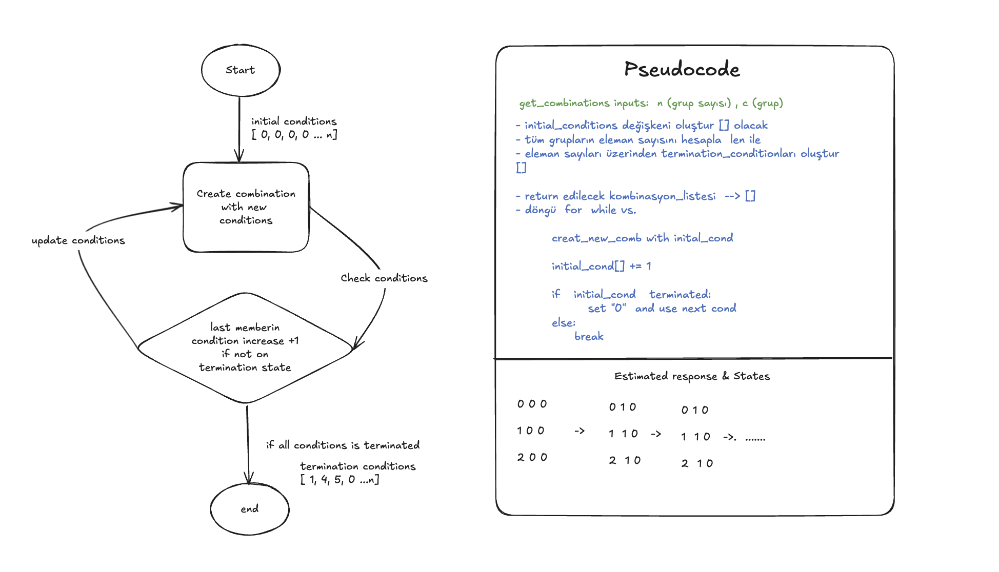

## Case-3 Açıklaması

- Case-3'ü ilk okuduğumda aklıma bir çok potansiyel çözüm geldi. Bu çözümler arasında standart olanları yapmaktansa daha farklı bir bakış açısı ile çözüm üretmek istedim. Bu noktada odaklandığım ilk şey kodun okunulabilirliği ve performansı oldu. İstenilen durumu matematiksel olarak modellemek istediğimde aslında sorunun FSM (Finite-state machine) problemlerine benzediğini farkettim. 

        FSM yapısı algoritma tasarlanırken yazılım mühendisliğine bazen kullanılmaktadır.

- Hızlıca bir diagram oluşturarak bunu koda döktüm ve ilk denememde sorunsuz çalıştı. Yukarıda bahsettiğim diğer çözümleride zamanım kaldığı için alternatif olarak koda ekliyorum.

### FSM (Finite-State Machine) Çözümü

- Burada ki bahsedilen kısımları koda yorum satırı olarak eklemeye çalışcağım.

    - Case aslında bir kombinasyon problemi olduğu için ilk başta kombinasyon uzunluğu ve sayısını belirledim.

            "n" grup içeren bir case için tek bir kombinasyon uzunluğu yine "n" olacaktı.
    
            Örneğin 6 gruplu bir veride bir kombinasyon ( _ _ _ _ _ _ ) 6 eleman içerecekti.

    - Bu durumda aslında tüm kombinasyonlar bütün grupların elemanlarının index numaralarının farklı şekilde sıralanması ile elde edilecekti.

            Örneğin 6 grup'a ait bir kombinasyon için indexler (sayılar);

            C(...,G6) = (0, 3, 5, 1 ,1 ,0)
            
            şeklinde ifade edilecekti.

    - Algoritma bir döngü üzerinden yüreyeceği için FSM sistemimizin bir başlangıç **(initial conditions)** ve bitiş durumları **(terminaton conditions)** bulunacaktı. Başlangıç durumu grupların ilk indexi yani 0 dan başlayacak ve listenin eleman sayısında son bulacak. Aşağıda örnek conditions veriyorum.

            1. Grup: 3 eleman
            2. Grup: 2 eleman
            3. Grup: 4 eleman 

            olmak üzere 3 Gruplu örnek bir veri seti için ;

            Kombinasyon initial_conditions indexleri = [ 0, 0, 0]
            Kombinasyon terminaton conditions indexleri = [ 2, 1, 3] 
             
            olarak belirlenecektir.
            
    - Şimdi belirlediğim değişkenler ile bir FSM diagramı oluşturup modelimin pseudocode' nu çıkardım.

     

    - Artık elimde diagram ve pseudocode bulunduğuna göre kalan tek şey belirlediğim algoritmayı kodlamak oldu.

Yaparken keyif aldım güzel bir çalışma olmuş. Zaman ayırıp okuduğunuz için teşekkür ederim. - Emre